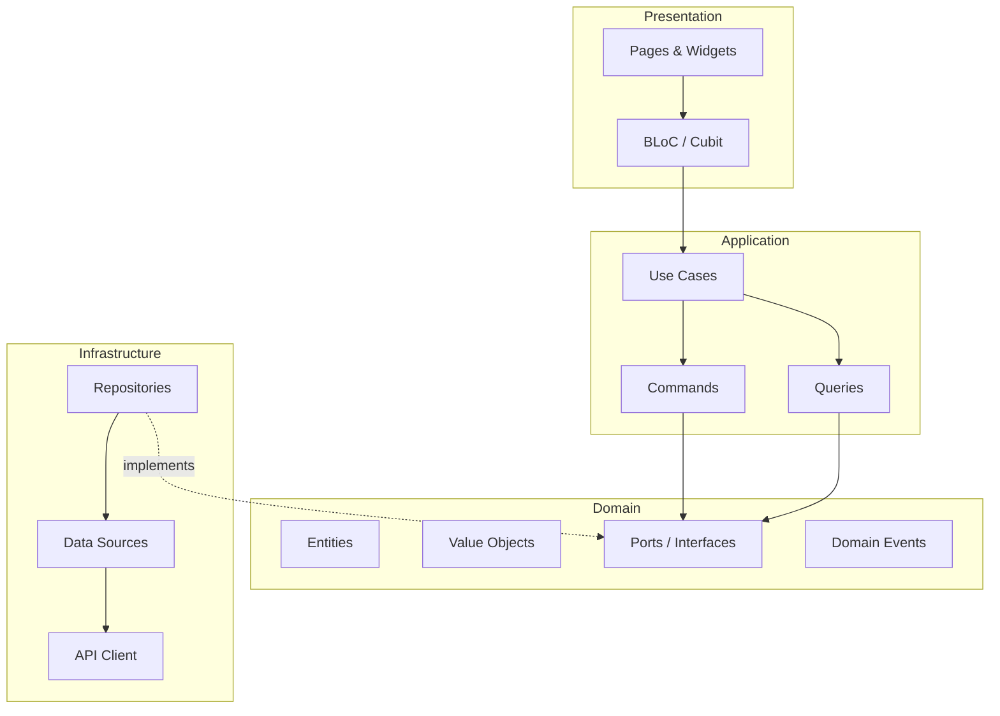
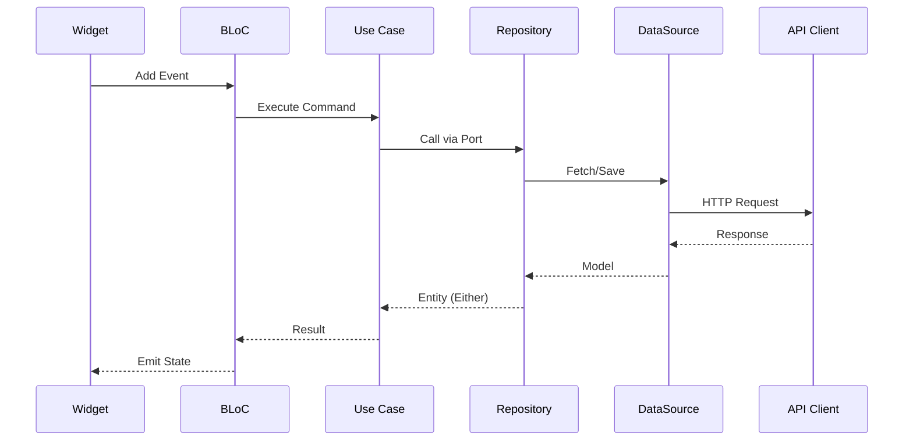
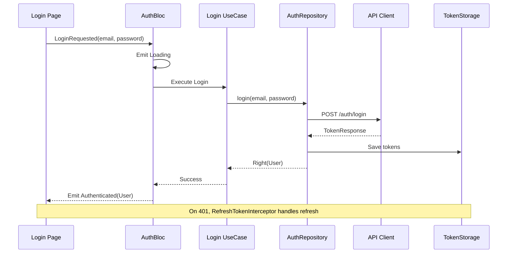
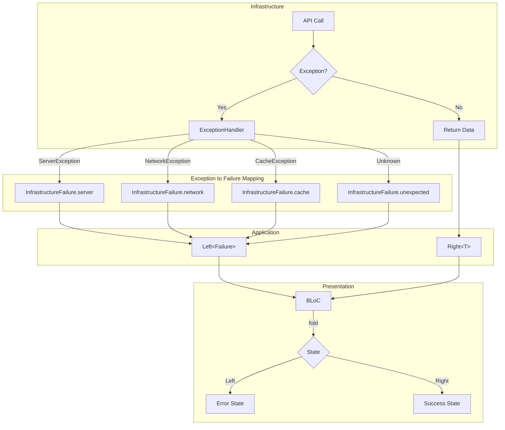
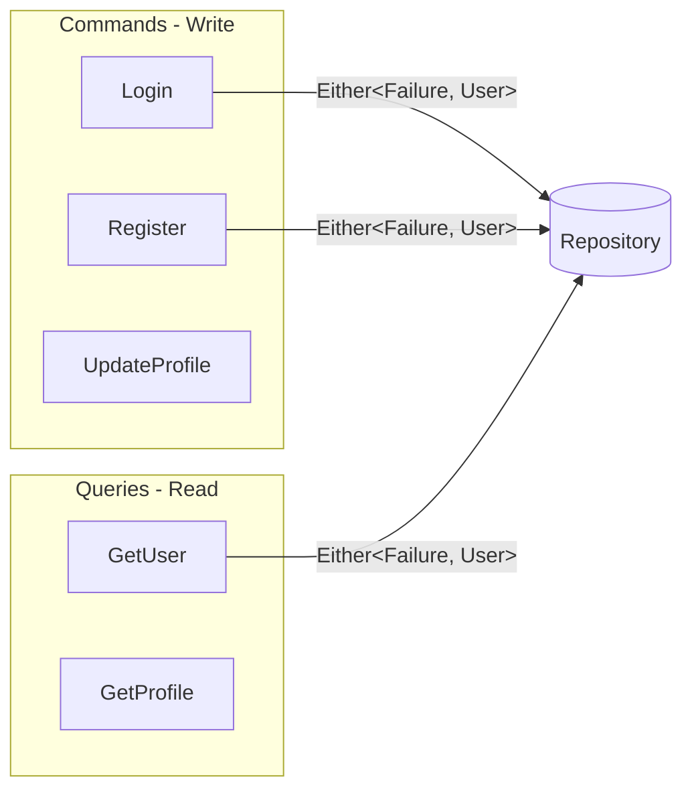

# Architecture & Design Guide

This project follows a strict **Clean Architecture** implementation combined with **Domain-Driven Design (DDD)** tactical patterns and **Hexagonal Architecture** (Ports & Adapters) principles.

---

## 🏗 High-Level Overview

The system is designed around the **Dependency Rule**: source code dependencies can only point *inwards*. Inner layers know nothing about outer layers.



### Layers

1.  **Domain Layer (Core)**: The heart of the software. Contains business logic, entities, and interfaces (ports). **Zero dependencies** on Flutter, frameworks, or libraries.
2.  **Application Layer**: Orchestrates domain objects to perform tasks. Contains use cases (Commands/Queries).
3.  **Infrastructure Layer**: Implements interfaces (adapters). Handles external concerns like API calls, databases, and platform channels.
4.  **Presentation Layer**: UI logic and views. Uses BLoC for state management.

---

## 🔄 Data Flow

### Request Flow (User Action → API)



---

## 🔐 Authentication Flow



---

## ⚠️ Error Handling Flow



---

## 🧩 Key Architectural Patterns

### 1. Domain-Driven Design (DDD)

I use DDD tactical patterns to model complex business rules:

| Pattern | Example | Purpose |
|---------|---------|---------|
| **Aggregate Root** | `User`, `UserProfile` | Consistency boundary |
| **Entity** | Objects with `UniqueId` | Identity and lifecycle |
| **Value Object** | `EmailAddress`, `Name` | Immutable, self-validating |
| **Domain Event** | `UserRegistered` | Side effects |
| **Specification** | `UserCanLoginSpec` | Business rules |

### 2. CQRS (Command Query Responsibility Segregation)



### 3. Hexagonal Architecture (Ports & Adapters)

-   **Ports:** Interfaces defined in the `Domain` layer (e.g., `IAuthRepository`, `IPlatformInfo`)
-   **Adapters:** Implementations in `Infrastructure` (e.g., `AuthRepositoryImpl`, `PlatformInfoImpl`)
-   **Benefit:** Swap implementations (e.g., real API vs mock) without touching business logic

### 4. Result Pattern (Error Handling)

I do **not** use exceptions for flow control. I use functional error handling with `fpdart`:
-   Return `Future<Either<Failure, T>>` instead of throwing
-   **Failure:** Base class for all errors
-   **Exceptions:** Only used internally in `Infrastructure` (caught and mapped to Failures)

---

## 📂 Project Structure

I follow a **Feature-First** structure with a shared **Core**:

```text
lib/
├── app/                  # App entry point, global providers, routing
├── core/                 # Shared logic across features
│   ├── domain/           # Base classes (Entity, ValueObject, Failure)
│   ├── application/      # Global app services (Bootstrap, Env)
│   ├── infrastructure/   # Base repos, network clients, storage
│   ├── presentation/     # Shared widgets, themes, l10n
│   └── error/            # Centralized error handling
└── features/             # Feature modules
    ├── auth/
    │   ├── domain/       # Feature-specific business logic
    │   ├── application/  # Feature services (optional)
    │   ├── infrastructure/ # API implementations, DTOs
    │   └── presentation/ # UI, BLoCs
    ├── dashboard/
    ├── orders/
    ├── profile/
    └── settings/
```

---

## 🛡 Security & Best Practices

-   **Type Safety:** `strict-mode` enabled. `freezed` for unions/data classes. `ValueObjects` for validation.
-   **State Management:** `flutter_bloc` for predictable state transitions.
-   **Dependency Injection:** `injectable` + `get_it` for decoupling.
-   **Testing:**
    -   **Unit:** Domain & Application logic (100% coverage goal)
    -   **Widget:** UI components (Golden tests)
    -   **Integration:** Full user flows

---

## 🚀 How to Add a New Feature

1.  **Domain:** Define `Entity`, `ValueObjects`, and `Repository` interface
2.  **Infrastructure:** Implement `Repository` and `RemoteDataSource`. Map DTOs to Entities
3.  **Presentation:** Create `BLoC` to handle state. Build `Page` and `Widgets`
4.  **DI:** Register new classes in `configureDependencies`

Or use Mason: `mason make feature --feature_name payments`

---

## ❌ Common Pitfalls to Avoid

-   **Do NOT** import `infrastructure` classes into `domain`
-   **Do NOT** use `Flutter` widgets in `domain` or `application`
-   **Do NOT** throw exceptions in `domain` logic (return `Left(Failure)`)
-   **Do NOT** put logic in UI widgets (keep them dumb)

---

## 📚 Architecture Decision Records

Key decisions are documented in [docs/adr/](./docs/adr/):

| ADR | Decision |
|-----|----------|
| [ADR-001](./docs/adr/0001-clean-architecture-ddd.md) | Clean Architecture + DDD |
| [ADR-002](./docs/adr/0002-flutter-bloc-state-management.md) | flutter_bloc for state management |
| [ADR-003](./docs/adr/0003-fpdart-error-handling.md) | fpdart for error handling |
| [ADR-004](./docs/adr/0004-go-router-navigation.md) | go_router for navigation |
| [ADR-005](./docs/adr/0005-injectable-dependency-injection.md) | injectable + get_it for DI |
| [ADR-006](./docs/adr/0006-domain-events-event-dispatcher.md) | Domain Events & Event Dispatcher |
| [ADR-007](./docs/adr/0007-specification-pattern.md) | Specification Pattern |
| [ADR-008](./docs/adr/0008-freezed-immutable-classes.md) | freezed for failures, states, DTOs |
| [ADR-009](./docs/adr/0009-secure-token-storage.md) | Secure Token Storage |
| [ADR-010](./docs/adr/0010-cqrs-command-query.md) | CQRS with Command/Query |
| [ADR-011](./docs/adr/0011-context-aware-failure-mapping.md) | Context-Aware Failure Mapping |
| [ADR-012](./docs/adr/0012-chopper-interceptor-chain.md) | Chopper Interceptor Chain |
| [ADR-013](./docs/adr/0013-feature-flags.md) | Feature Flags |
| [ADR-014](./docs/adr/0014-websocket-reconnection.md) | WebSocket Reconnection |
| [ADR-015](./docs/adr/0015-theme-responsive-design.md) | Theme & Responsive Design |
| [ADR-016](./docs/adr/0016-design-token-constants.md) | Design Token Constants |
| [ADR-017](./docs/adr/0017-mason-bricks-code-generation.md) | Mason Bricks Code Generation |
