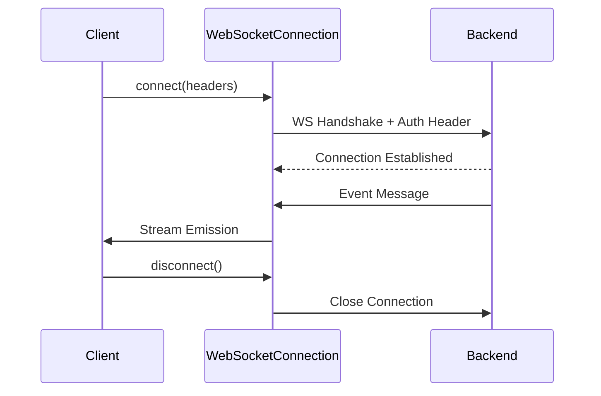

# WebSocket Infrastructure

## Overview

This directory contains the WebSocket infrastructure for real-time communication with the backend. Supports **multiple concurrent WebSocket connections** to different endpoints.

## Architecture

This module follows **hexagonal architecture** (ports and adapters):

- **Ports** (interfaces) are defined in `lib/core/domain/ports/`
- **Adapters** (implementations) are here in infrastructure

```text
lib/core/
├── domain/
│   └── ports/
│       ├── i_websocket_connection.dart   # Port interface for connections
│       ├── i_websocket_manager.dart      # Port interface for manager
│       └── ports.dart                    # Barrel export
│
└── infrastructure/
    └── websocket/
        ├── websocket_connection.dart         # Adapter implementation
        ├── websocket_connection_state.dart   # Connection state enum
        ├── websocket_reconnection_config.dart # Reconnection configuration
        ├── websocket_manager.dart            # Manager adapter implementation
        ├── websocket.dart                    # Barrel export file
        ├── README.md                         # Main documentation (this file)
        ├── RECONNECTION.md                   # Reconnection guide
        └── EXAMPLES.md                       # Complete usage examples
```

## Features

- ✅ **Hexagonal Architecture**: Clean separation of ports (interfaces) and adapters
- ✅ **Multiple Concurrent Connections**: Listen to different endpoints simultaneously
- ✅ **Automatic Reconnection**: Reconnects automatically with exponential backoff + jitter
- ✅ **Connection State Management**: Track connection state (connected, reconnecting, failed, etc.)
- ✅ **Real-time Communication**: Persistent WebSocket connections for live updates
- ✅ **Authenticated Connections**: Automatic Bearer token injection in headers
- ✅ **Independent Lifecycle**: Each connection has its own lifecycle management
- ✅ **Configurable Retry Strategies**: Default, aggressive, conservative, or custom configurations
- ✅ **Jitter Support**: Prevents thundering herd problem on server restarts
- ✅ **Error Handling**: Comprehensive error handling and logging
- ✅ **Stream-based**: Reactive programming with Dart Streams
- ✅ **Dependency Injection**: Integrated with GetIt + Injectable
- ✅ **Environment Aware**: Automatic URL switching (dev/staging/prod)

## Configuration

### Environment URLs

WebSocket URLs are automatically derived from the API base URL:

```dart
// config/development.json
{
  "API_URL": "http://localhost:3000"
  // WebSocket URL: ws://localhost:3000
}

// config/production.json
{
  "API_URL": "https://api.example.com"
  // WebSocket URL: wss://api.example.com
}
```

You can also explicitly set the WebSocket URL:

```json
{
  "API_URL": "https://api.example.com",
  "WS_URL": "wss://ws.example.com"
}
```

## Usage

### 1. Multiple Concurrent Connections with Auto-Reconnection

Use `IWebSocketManager` to create and manage multiple independent connections:

```dart
// Get manager from DI (using interface)
final manager = getIt<IWebSocketManager>();

// Create connection to auth endpoint with default reconnection
final authConnection = manager.createConnection('/ws/auth');

// Create connection with aggressive reconnection for critical features
final notifConnection = manager.createConnection(
  '/ws/notifications',
  reconnectionConfig: WebSocketReconnectionConfig.aggressive,
);

// Create connection with custom reconnection config
final chatConnection = manager.createConnection(
  '/ws/chat',
  reconnectionConfig: WebSocketReconnectionConfig(
    maxAttempts: 5,
    initialDelay: Duration(seconds: 2),
    jitterFactor: 0.3, // ±30% random variation
  ),
);

// Listen to connection state changes
authConnection.connectionState.listen((state) {
  print('Auth connection: ${state.displayName}');
});

// Connect all
await authConnection.connect(headers: {'Authorization': 'Bearer $token'});
await notifConnection.connect(headers: {'Authorization': 'Bearer $token'});
await chatConnection.connect(headers: {'Authorization': 'Bearer $token'});

// All connections work independently and automatically reconnect if lost!
authConnection.messages.listen((msg) => handleAuthEvent(msg));
notifConnection.messages.listen((msg) => handleNotification(msg));
chatConnection.messages.listen((msg) => handleChatMessage(msg));

// Send messages (only when connected)
if (chatConnection.isConnected) {
  chatConnection.send(jsonEncode({'message': 'Hello!'}));
}

// Disconnect individual connections
await authConnection.disconnect();

// Or disconnect all connections at once
await manager.disconnectAll();
```

**📖 For detailed reconnection documentation, see [RECONNECTION.md](RECONNECTION.md)**

### 2. Direct Connection Creation

Create standalone connections without the manager:

```dart
import 'package:starter_app/core/infrastructure/websocket/websocket_connection.dart';

final connection = WebSocketConnection(
  url: 'wss://api.example.com/ws/custom',
  logger: logger,
  onConnected: () => print('Connected!'),
  onDisconnected: () => print('Disconnected'),
  onError: (error) => print('Error: $error'),
);

await connection.connect(headers: {'Authorization': 'Bearer $token'});

connection.messages.listen((message) {
  final json = jsonDecode(message);
  print('Received: $json');
});

await connection.disconnect();
```

### 3. Feature-Specific Data Sources (Recommended Pattern)

For feature-specific WebSocket connections, create a data source that manages its own connection:

```dart
@LazySingleton(as: INotificationWebSocketDataSource)
class NotificationWebSocketDataSource {
  NotificationWebSocketDataSource(
    this._webSocketManager,
    this._tokenStorage,
    this._logger,
  );

  final IWebSocketManager _webSocketManager;
  final ITokenStorage _tokenStorage;
  final IAppLogger _logger;

  IWebSocketConnection? _connection;
  StreamController<Notification>? _controller;

  Stream<Notification> watchNotifications() {
    if (_controller != null) {
      return _controller!.stream;
    }

    _controller = StreamController<Notification>.broadcast(
      onListen: _onListen,
      onCancel: _onCancel,
    );

    return _controller!.stream;
  }

  Future<void> _onListen() async {
    final token = await _tokenStorage.getAccessToken();
    
    // Create dedicated connection for notifications
    _connection = _webSocketManager.createConnection('/ws/notifications');
    
    await _connection!.connect(
      headers: {'Authorization': 'Bearer $token'},
    );

    _connection!.messages.listen(
      (message) {
        final json = jsonDecode(message);
        final notification = Notification.fromJson(json);
        _controller?.add(notification);
      },
      onError: (error) => _logger.error('Notification WS error', error: error),
    );
  }

  Future<void> _onCancel() async {
    await _connection?.disconnect();
    _connection = null;
    await _controller?.close();
    _controller = null;
  }
}
```

This pattern allows:

- ✅ Independent connection per feature
- ✅ Multiple features can have active WebSocket connections simultaneously
- ✅ Automatic cleanup when no listeners
- ✅ Type-safe domain models

## Real-World Example: Multiple Endpoints

Here's a complete example showing multiple WebSocket endpoints working simultaneously:

```dart
// In your app initialization or where needed
final manager = getIt<IWebSocketManager>();

// Feature 1: Auth state changes
final authWsDataSource = getIt<IAuthWebSocketDataSource>();
authWsDataSource.watchAuthChanges().listen((user) {
  if (user != null) {
    print('User authenticated: ${user.name}');
  } else {
    print('User logged out');
  }
});

// Feature 2: Real-time notifications
final notifWsDataSource = getIt<INotificationWebSocketDataSource>();
notifWsDataSource.watchNotifications().listen((notification) {
  print('New notification: ${notification.title}');
  showNotificationBanner(notification);
});

// Feature 3: Live chat messages
final chatWsDataSource = getIt<IChatWebSocketDataSource>();
chatWsDataSource.watchMessages('room-123').listen((message) {
  print('New chat message: ${message.text}');
  updateChatUI(message);
});

// Feature 4: Live order tracking
final orderWsDataSource = getIt<IOrderWebSocketDataSource>();
orderWsDataSource.watchOrderStatus('order-456').listen((status) {
  print('Order status updated: ${status.state}');
  updateOrderStatus(status);
});

// All 4 WebSocket connections are active simultaneously!
// Each feature has its own independent connection.
```

### 4. Repository Integration

```dart
@LazySingleton(as: INotificationRepository)
class NotificationRepositoryImpl implements INotificationRepository {
  NotificationRepositoryImpl(this._webSocketDataSource);

  final INotificationWebSocketDataSource _webSocketDataSource;

  @override
  StreamResult<Notification> watchNotifications() {
    return _webSocketDataSource
        .watchNotifications()
        .map((notification) => right<Failure, Notification>(notification))
        .handleError((error) {
          return left<Failure, Notification>(
            const InfrastructureFailure.network(
              message: 'WebSocket connection error',
            ),
          );
        });
  }
}
```

## Authentication Example

The auth feature uses WebSocket for real-time authentication state changes:

```dart
// Backend sends events like:
{
  "event": "user_authenticated",
  "data": {
    "id": "123",
    "name": "John Doe",
    "email": "john@example.com"
  }
}

// Frontend receives and updates auth state:
authRepository.watchAuthChanges().listen((result) {
  result.fold(
    (failure) => print('Error: ${failure.message}'),
    (user) => user != null
      ? print('User logged in: ${user.name}')
      : print('User logged out'),
  );
});
```

## Backend Requirements

Your backend WebSocket endpoints should:

1. **Accept Bearer token authentication** in connection headers
2. **Send JSON-formatted messages**
3. **Handle connection lifecycle** (connect, disconnect, reconnect)
4. **Follow consistent event format**:

```json
{
  "event": "event_name",
  "data": { /* event-specific data */ },
  "timestamp": "2025-01-15T10:30:00Z"
}
```

## Connection Flow



## Error Handling

WebSocket errors are automatically handled:

- **Connection failures**: Logged and trigger reconnection
- **Message parse errors**: Logged and skipped
- **Disconnections**: Logged and trigger reconnection (if not manual)
- **Unexpected errors**: Logged with stack trace

## Testing

### Mock WebSocket Connection

```dart
class MockWebSocketConnection extends Mock implements IWebSocketConnection {}
class MockWebSocketManager extends Mock implements IWebSocketManager {}

test('should receive user updates via WebSocket', () async {
  final mockManager = MockWebSocketManager();
  final mockConnection = MockWebSocketConnection();
  final controller = StreamController<String>();
  
  when(() => mockManager.createConnection(any())).thenReturn(mockConnection);
  when(() => mockConnection.messages).thenAnswer((_) => controller.stream);
  when(() => mockConnection.connect(headers: any(named: 'headers')))
      .thenAnswer((_) async {});

  final dataSource = NotificationWebSocketDataSource(
    mockManager, 
    tokenStorage, 
    logger,
  );
  
  // Emit test message
  controller.add(jsonEncode({
    'event': 'notification',
    'data': {'id': '123', 'title': 'Test'}
  }));

  // Verify
  expect(
    dataSource.watchNotifications(),
    emits(isA<NotificationModel>()),
  );
});
```

## Troubleshooting

### Connection Issues

1. **Check backend URL**: Ensure `API_URL` is correct in config
2. **Verify WebSocket support**: Backend must support WebSocket protocol
3. **Check authentication**: Token must be valid and not expired
4. **Network connectivity**: Ensure device/emulator has internet access

### Message Not Received

1. **Check backend logs**: Verify backend is sending messages
2. **Verify JSON format**: Messages must be valid JSON strings
3. **Check event names**: Event type must match frontend expectations
4. **Enable debug logs**: Check `IAppLogger` for WebSocket messages

## Dependencies

- `web_socket_channel: ^3.0.1` - WebSocket client library
- `injectable: ^2.5.2` - Dependency injection
- `logging: ^1.3.0` - Logging infrastructure

## Migration Guide

### From Old Singleton Pattern to New Interface-Based Pattern

**Before (Singleton - Tightly Coupled):**

```dart
@LazySingleton(as: IMyWebSocketDataSource)
class MyWebSocketDataSource {
  MyWebSocketDataSource(this._webSocketManager);

  final WebSocketManager _webSocketManager;  // Concrete class - tight coupling
  
  WebSocketConnection? _connection;  // Concrete class
}
```

**After (Interface-Based - Loosely Coupled):**

```dart
@LazySingleton(as: IMyWebSocketDataSource)
class MyWebSocketDataSource {
  MyWebSocketDataSource(this._webSocketManager);

  final IWebSocketManager _webSocketManager;  // Interface - loose coupling
  
  IWebSocketConnection? _connection;  // Interface - testable
}
```

## Connection Lifecycle

```text
                Multiple Features
                       │
        ┌──────────────┼──────────────┐
        │              │              │
   Auth Feature   Notifications   Chat Feature
        │              │              │
        ▼              ▼              ▼
   Connection 1   Connection 2   Connection 3
        │              │              │
        └──────────────┴──────────────┘
                       │
              IWebSocketManager
                       │
               Backend Server
```

## Performance Considerations

### Connection Limits

- **Browser**: Most browsers support 6-8 concurrent connections per domain
- **Mobile**: No hard limit, but consider battery/network usage
- **Recommended**: 2-5 active WebSocket connections per app

### Best Practices

1. **Share connections when possible**: If multiple features need the same data, use one connection with message filtering
2. **Close unused connections**: Always disconnect when no longer needed
3. **Lazy initialization**: Only connect when stream has listeners
4. **Cleanup on disposal**: Implement proper cleanup in data sources

## Documentation

- **[README.md](README.md)** - Main documentation (this file)
- **[RECONNECTION.md](RECONNECTION.md)** - Complete reconnection guide with state management
- **[EXAMPLES.md](EXAMPLES.md)** - Real-world examples for multiple features

## Implemented Features

- ✅ Automatic reconnection on disconnect with exponential backoff + jitter
- ✅ Connection state management (connecting, connected, reconnecting, failed, disconnected)
- ✅ Multiple concurrent connections to different endpoints
- ✅ Configurable retry strategies (default, aggressive, conservative, custom)
- ✅ Connection state streams for reactive UI updates
- ✅ Independent connection lifecycle management
- ✅ Hexagonal architecture with ports and adapters
- ✅ Jitter to prevent thundering herd problem

## Future Enhancements

- [ ] Connection heartbeat/ping-pong for keep-alive
- [ ] Message queue for offline mode (cache and replay)
- [ ] Connection pool with max limits per domain
- [ ] Shared connection multiplexing for same endpoint
- [ ] Metrics and monitoring (connection count, message rates, latency)
- [ ] Compression support for messages
- [ ] Binary message support (currently JSON only)
