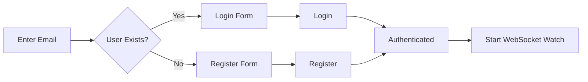

# Authentication Feature

Email-first authentication with JWT tokens, WebSocket session management, and reactive state handling.

## Architecture

```
lib/features/auth/
├── domain/           # Core business logic (no Flutter dependencies)
│   ├── entities/     # User, UserId, AuthCredentials
│   ├── events/       # Domain events (UserLoggedIn, UserRegistered, etc.)
│   ├── failure/      # AuthFailure types
│   ├── repositories/ # IAuthRepository interface
│   ├── services/     # UserRegistrationService
│   └── value_objects/ # AuthToken, RefreshToken
├── application/      # Use cases (Commands & Queries)
│   └── usecases/     # Login, Register, Logout, RefreshToken, etc.
├── infrastructure/   # External implementations
│   ├── datasources/  # API service, WebSocket, remote data source
│   ├── mappers/      # Exception → Failure mapping
│   ├── models/       # Freezed DTOs
│   └── repositories/ # AuthRepositoryImpl
├── presentation/     # UI layer
│   ├── bloc/         # AuthBloc, events, states
│   ├── pages/        # AuthPage
│   ├── widgets/      # LoginForm, RegisterForm
│   └── routes/       # Route definitions
└── l10n/             # Localization
```

## Authentication Flow



## Key Patterns

### 1. Email-First Flow
Users enter email first, then either login or register based on existence check.

```dart
// Check if user exists
final exists = await checkUserExists(email);
// Show appropriate form
exists ? showLoginForm() : showRegisterForm();
```

### 2. Railway-Oriented Error Handling
All operations return `Either<Failure, T>` for composable error handling.

```dart
final result = await login(credentials);
result.fold(
  (failure) => emit(AuthState.error(failure)),
  (user) => emit(AuthState.authenticated(user)),
);
```

### 3. Domain Events
Cross-feature communication via domain events:
- `UserLoggedIn` - User actively logged in
- `UserRegistered` - New account created
- `UserSessionRestored` - Session restored from tokens
- `UserLoggedOut` - User logged out

### 4. Secure Token Storage
Tokens stored in `ITokenStorage` (flutter_secure_storage wrapper).
Automatic refresh via interceptor when access token expires.

### 5. WebSocket Session Management
Real-time auth state updates via WebSocket connection.
Handles session expiration, token revocation, and forced logouts.

## Usage

### Initialize Auth
```dart
// In app startup
authBloc.add(const AuthEvent.getCurrentUser());
```

### Listen to Auth State
```dart
BlocBuilder<AuthBloc, AuthState>(
  builder: (context, state) => state.when(
    initial: (email, ...) => EmailEntryForm(),
    loginRequired: (...) => LoginForm(),
    registrationRequired: (...) => RegisterForm(),
    authenticated: (user) => HomePage(user: user),
    unauthenticated: () => const SizedBox(),
  ),
)
```

### Perform Authentication
```dart
// Login
authBloc.add(const AuthEvent.loginSubmitted());

// Register  
authBloc.add(const AuthEvent.registerSubmitted());

// Logout
authBloc.add(const AuthEvent.logoutRequested());
```

## State Machine

| State | Description |
|-------|-------------|
| `Initial` | Email entry form |
| `LoginRequired` | Email exists, show password field |
| `RegistrationRequired` | New user, show name + password fields |
| `Authenticated` | User logged in |
| `Unauthenticated` | Session ended |

## Testing

```bash
# Run auth tests
flutter test test/features/auth/

# Analyze
flutter analyze lib/features/auth/
```

## Dependencies

- **fpdart** - Functional programming (Either, Option)
- **flutter_bloc** - State management
- **freezed** - Immutable DTOs and states
- **injectable** - Dependency injection
- **web_socket_channel** - WebSocket connections
- **meta** - Annotations (@immutable)
